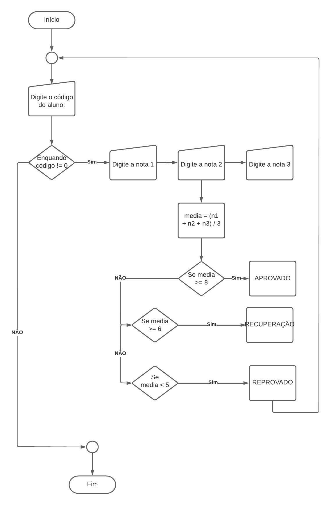

# Exercício 5 da AC2
 Média Fundamental

## Algoritmo do Exercício
    INÍCIO
        ESCREVA('Digite o código do aluno: ')
        ENQUANTO código != 0, FAÇA
           ESCREVA('Digite a nota 1: '), FAÇA
            ESCREVA('Digite a nota 2: '), FAÇA
            ESCREVA('Digite a nota 3: '), FAÇA
            media = (nota1 + nota2 + nota3) / 3
            SE media >= 8, FAÇA
                ESCREVA('APROVADO ')
            SE NÃO SE media > 6, FAÇA
                ESCREVA('RECUPERAÇÃO')
            SE NÃO
                ESCREVA('REPROVADO')
            FIM SE
            SE código = 0, FAÇA
                ESCREVA('Fim do programa')
            FIM SE
        FIM ENQUANTO
    FIM

## Fluxograma

